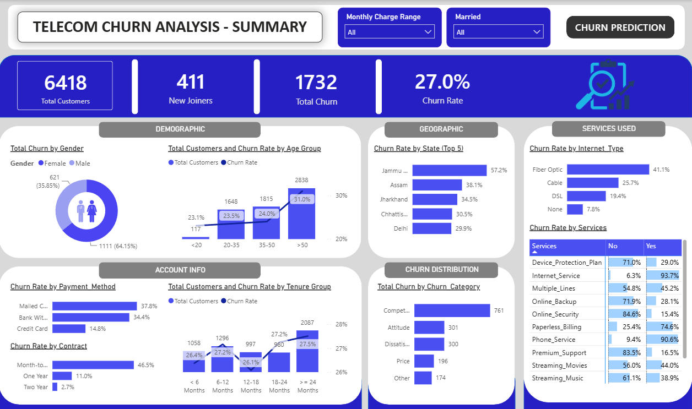
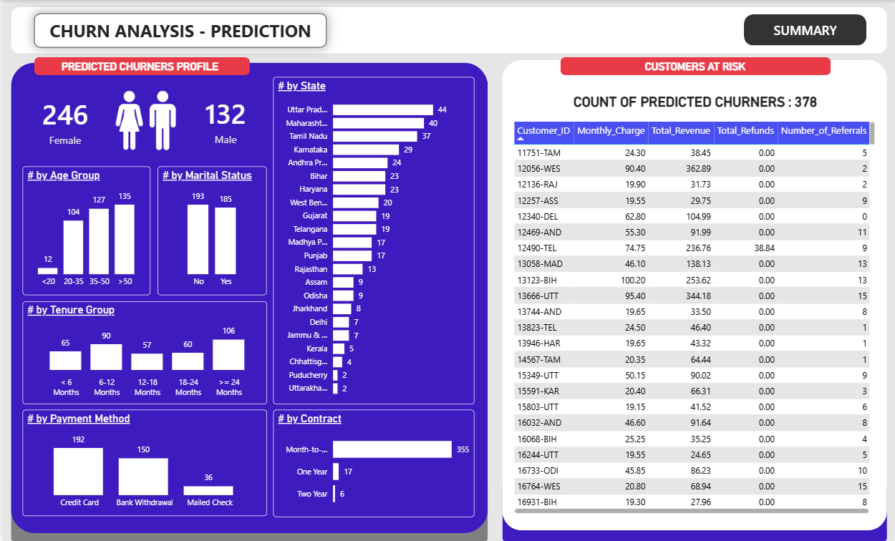

# 📡 Telecom Customer Churn Analysis & Prediction Pipeline

**An End-To-End Churn Analytics Solution: Excel → SQL Server ETL → Random Forest Prediction → Power BI Dashboard Analytics.**

## 📌 Overview

Customer churn is one of the most expensive problems in the telecom industry — acquiring a new customer typically costs far more than retaining an existing one. This project builds a complete pipeline that takes raw customer records, provide analytics on the existing churned customers, all the way to an actionable list of **at-risk new customers**.

1. **SQL Server** — stage, clean, and productionize the raw data.
2. **Python / Scikit-Learn** — train a classifier on historical churn outcomes and score new customers.
3. **Power BI** — visualize churn drivers and demographics for stakeholders.

The dataset covers **6,418 telecom customers** across Indian states (Delhi, Maharashtra, Tamil Nadu, West Bengal, etc.), with 32 attributes spanning demographics, subscribed services, contract terms, and billing.

---

## 📸 Preview

| Churn Summary | Prediction Summary |
|---|---|
|  |  |

## 📂 Repository Structure

```
telecom-churn-analysis-and-prediction-pipeline/

├── dashboard/
│   └── churn_analysis_and_prediction_dashboard.pbix        # Power BI report
├── data/
│   ├── Customer_Data.csv          # Raw source data (6,418 customers, 32 columns)
│   └── prediction_data.xlsx       # vw_ChurnData & vw_JoinData exported from SQL
├── images/
|      ├── dasboard_prediction_analysis.png
|      └── dashboard_summary.png
├── notebooks/
│   └── predictive_analysis.ipynb  # Random Forest training, evaluation, and scoring
├── output/
│   └── Predictions.csv            # New customers flagged as likely to churn
├── sql/
│   ├── 01_data_exploration.sql             # Distribution checks (Gender, Contract, State, Status)
│   ├── 02_check_null_values.sql            # Null audit + churn-logic integrity checks
│   ├── 03_remove_nulls_and_insert_into_prod_table.sql  # Clean stg_Churn -> prod_Churn
│   └── 04_create_view_for_PowerBI.sql      # vw_ChurnData & vw_JoinData views
├── README.md 
└── requirement.txt
```

## 🧰 Tech Stack

- **Databases:** Excel, Microsoft SQL Server (T-SQL)
- **Predictive Analysis:** Python, Pandas, NumPy, Scikit-Learn, Matplotlib, Seaborn, Joblib
- **BI:** Power BI
- **Environment:** Jupyter Notebook
